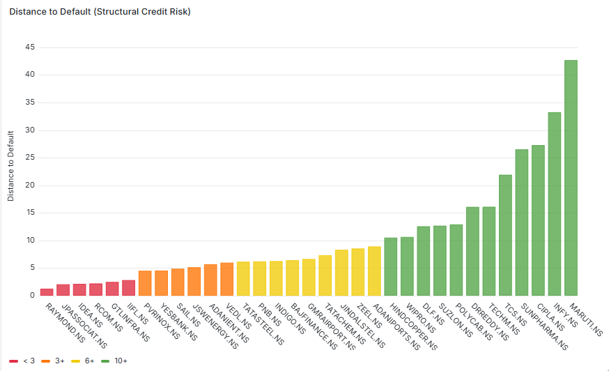
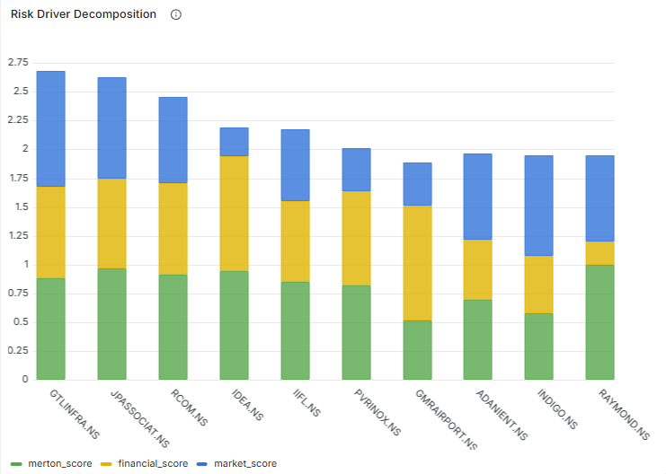
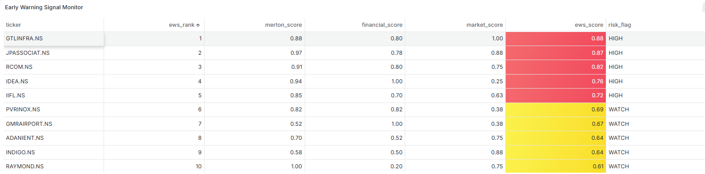

# Credit Risk Early Warning System (EWS)

A credit risk monitoring system that combines structural, financial, and market signals to identify firms showing early signs of financial distress.

The system computes a composite Early Warning Score (EWS) for a universe of NSE-listed companies, refreshed weekly via an automated pipeline, and visualizes risk signals through a live **PostgreSQL** + **Grafana** dashboard.

The model currently monitors **33 NSE-listed companies** across multiple sectors.

---

## Problem

Credit deterioration often appears in **market prices before financial statements** reflect stress.  
This project builds an **early warning framework** that integrates market and balance-sheet indicators to flag companies with rising credit risk.

---

## Methodology

Three independent risk modules are combined:

**Structural Risk – Merton Model**
- Estimates firm asset value and volatility from equity prices
- Estimates `Distance to Default (DD)` and implied `Probability of Default (PD)` using the Merton structural credit model.

**Financial Risk**
- Interest Coverage
- Debt / Equity
- Debt / Assets
- Current Ratio
- Return on Assets

**Market Stress Signals**
- 3-month momentum
- Volatility regime
- 6-month drawdown
- Relative return vs Nifty 50

**Final score:**

EWS = 0.30 × Merton  + 0.40 × Financial  + 0.30 × Market


Higher scores indicate **greater credit risk**.

---

## Dashboard

Risk signals are monitored through a **Grafana dashboard** backed by PostgreSQL.

**Panels include:**

- Distance to Default distribution
- Risk driver decomposition (structural / financial / market)
- Early Warning Score ranking



 



---

## SQL Risk Monitoring Queries

Analytical SQL queries are included for portfolio monitoring.
These queries demonstrate analytical SQL techniques such as window functions and portfolio risk segmentation.

- **Risk deterioration detection** using window functions
- **Top risk decile identification** using `NTILE`
- **Structural vs market signal divergence**

Example:

```sql
SELECT *
FROM (
  SELECT ticker,
         ews_score,
         NTILE(10) OVER (ORDER BY ews_score DESC) AS risk_decile
  FROM ews_scores
  WHERE run_date = (SELECT MAX(run_date) FROM ews_scores)
) t
WHERE risk_decile = 1;
```

---

## Repository Structure

```
credit-risk-ews/
│
├── src/                  # scoring models and data pipeline
├── sql/                  # analytical SQL queries for risk monitoring
│   ├── ews_deterioration_monitor.sql
│   ├── risk_decile_segmentation.sql
│   └── signal_divergence_analysis.sql
│
├── data/
│   └── sample_outputs/   # example scoring tables exported from PostgreSQL
│       ├── ews_scores_sample.csv
│       ├── financial_scores_sample.csv
│       ├── market_scores_sample.csv
│       └── merton_scores_sample.csv
│
├── notebooks/            # exploratory analysis and validation
├── config.yaml           # ticker universe and model parameters
├── run_pipeline.bat      # scheduled pipeline execution
├── FINDINGS.md           # model tuning log and observations
└── README.md
```

---

## Technologies

- Python  
- PostgreSQL  
- Grafana  
- Pandas / NumPy  
- yfinance
